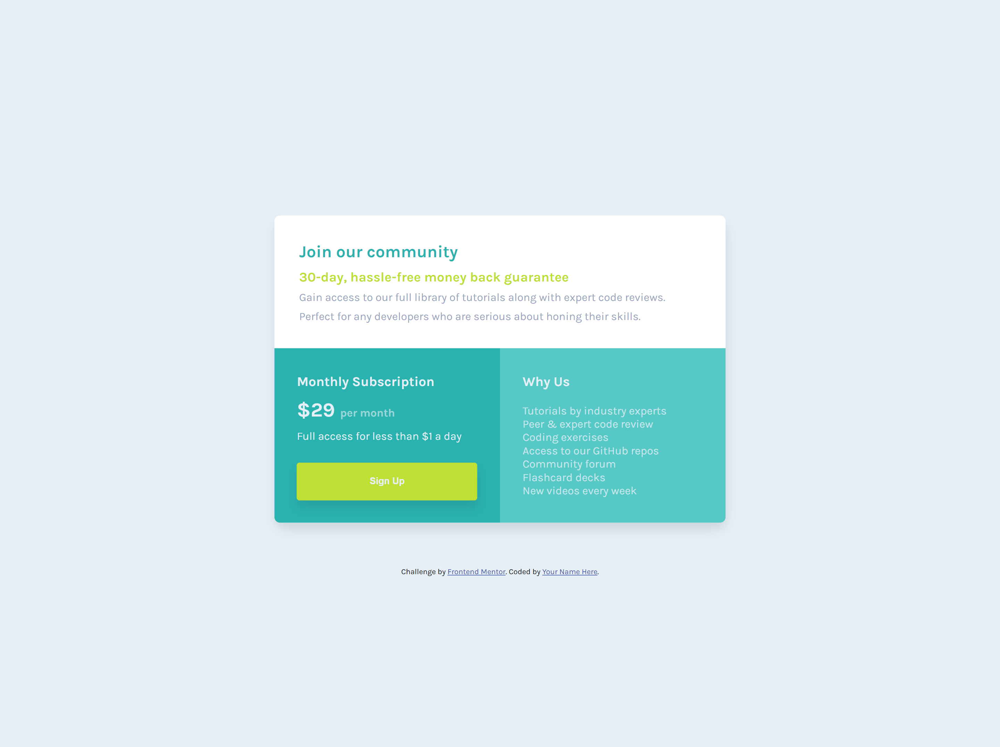

# Frontend Mentor - Single price grid component solution

This is a solution to the [Single price grid component challenge on Frontend Mentor](https://www.frontendmentor.io/challenges/single-price-grid-component-5ce41129d0ff452fec5abbbc). Frontend Mentor challenges help you improve your coding skills by building realistic projects.

## Table of contents

- [Overview](#overview)
  - [The challenge](#the-challenge)
  - [Screenshot](#screenshot)
  - [Links](#links)
- [My process](#my-process)
  - [Built with](#built-with)
  - [What I learned](#what-i-learned)
  - [Continued development](#continued-development)
  - [Useful resources](#useful-resources)
- [Author](#author)

**Note: Delete this note and update the table of contents based on what sections you keep.**

## Overview

### The challenge

Users should be able to:

- View the optimal layout for the component depending on their device's screen size
- See a hover state on desktop for the Sign Up call-to-action

### Screenshot



### Links

- Live Site URL: [Add live site URL here](https://glistening-gnome-af772f.netlify.app/)

## My process

### Built with

- Semantic HTML5 markup
- CSS custom properties
- Flexbox
- CSS Grid
- Mobile-first workflow

**Note: These are just examples. Delete this note and replace the list above with your own choices**

### What I learned

Initially I missed the mark in it's entirety I built the project using flex-box for the layout... then the project title dawned on me. It stated Single Price Grid Componenet, GRID!!!
At first glance it seemed easy enough, little did I realize I had minimal to none grid based knowledge. After few video tutorials, and a lovely game known as garden grid, I'd like to share I'm a tad more comfortable with the subject.

To see how you can add code snippets, see below:

```html these sections helped tons with when it comes to the responsive layouts, little trick I learned from Kevin Powell
<section class="top"><div class="row contianer">....</div></section>
```

```css, responsive styling, as well as the newly learnied grid styling!
 .wrapper {
    grid-template-columns: 1fr 1fr;
    border-radius: 1rem;
  }
  .join {
    grid-column-start: 1;
    grid-column-end: 3;
  }
```

```js didn't make part of this one

```

### Continued development

I hope to learn more about grid, theres a few projects I'm excited to apply this knowledge to.
This component could even develop into a much larger project, who knows I might even include this for one of my main portfolio projects.
I'd like to continue refining my skills by re-working this project using libraries and frameworks this one I kept pretty vanilla to reduce unecessary complexity.

### Useful resources

- [Example resource 1](https://cssgridgarden.com/) - It's a game, but games can be pretty handy when it comes to visual learners.
- [Example resource 2](https://www.youtube.com/watch?v=8QSqwbSztnA) - I'm a big fan of Kevin's and he provides helpful examples for grid in this video.

## Author

- Website - [Denise Moncada](https://www.moncadad.com)
- Frontend Mentor - [@moncadad](https://www.frontendmentor.io/profile/moncadad)
